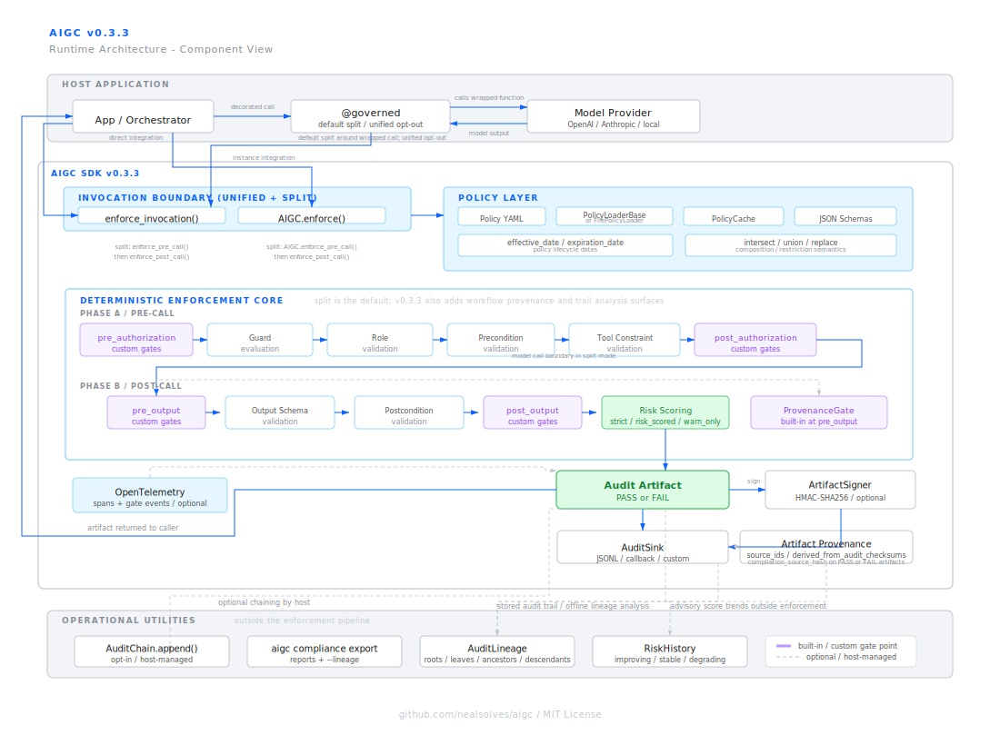

# PROJECT.md — AIGC Repository Guide

This is the repo-level orientation document for AIGC
(Auditable Intelligence Governance Contract). It is written for first-time
visitors who need to understand the current state, how the runtime is
organized, and how the project evolved release by release.

Use [README.md](README.md) for the quick start. Use this file for structure,
architecture, and release context.

## Current State

AIGC is a Python SDK that enforces governance at the AI invocation boundary.
The current release line is `v0.3.2` (`2026-04-05`).
`v0.3.3` planning is underway — see `docs/decisions/ADR-0010-governed-agentic-workflows.md`
and `docs/plans/v0.3.3_IMPLEMENTATION_PLAN.md` for the roadmap.

The shipped runtime supports:

- unified enforcement through `enforce_invocation()` and `AIGC.enforce()`
- split enforcement through `enforce_pre_call()` and `enforce_post_call()`
- typed fail-closed validation for invocation shape, role, preconditions, tool
  constraints, output schema, postconditions, and optional risk scoring
- tamper-evident audit artifacts with optional signing
- pluggable audit sinks, policy loaders, custom gates, telemetry, and policy
  testing helpers

The demo surface in this repo is a React frontend plus FastAPI backend that
walks through the `v0.3.x` capabilities.

## Architecture Snapshot



Current architecture assets:

- Component view:
  [docs/architecture/diagrams/aigc_architecture_component_light.svg](docs/architecture/diagrams/aigc_architecture_component_light.svg)
- Pipeline view:
  [docs/architecture/diagrams/aigc_architecture_pipeline_light.svg](docs/architecture/diagrams/aigc_architecture_pipeline_light.svg)
- Authoritative design narrative:
  [docs/architecture/AIGC_HIGH_LEVEL_DESIGN.md](docs/architecture/AIGC_HIGH_LEVEL_DESIGN.md)

### How to read the diagram

- The host application owns orchestration and model calls.
- AIGC owns policy loading, ordered governance checks, and audit artifact
  generation.
- Unified mode runs the entire gate sequence in one call.
- Split mode moves the host model call between authorization-side checks and
  output-side checks without changing gate order.
- Audit sinks, signing, telemetry, and audit chaining are supporting layers
  around the enforcement core, not replacements for it.

### Runtime flow

1. Load and validate the policy, including composition and policy dates when
   configured.
2. Run authorization-side gates: custom pre-authorization gates, guard and
   condition resolution, role validation, precondition checks, tool
   constraints, custom post-authorization gates.
3. Run output-side gates: custom pre-output gates, output schema validation,
   postconditions, custom post-output gates, and optional risk scoring.
4. Emit one final PASS or FAIL audit artifact for the invocation attempt.

`v0.3.2` keeps unified mode as the default compatibility path and adds the
split handoff token (`PreCallResult`) for hosts that need pre-call governance.

## Repository Map

This tree focuses on the parts of the repo a new visitor is most likely to use.

```text
aigc/
├── aigc/                           Public package surface
│   ├── __init__.py                 Stable imports
│   ├── enforcement.py              Public enforcement entry points
│   ├── decorators.py               Public @governed surface
│   ├── sinks.py                    Public audit sink surface
│   └── _internal/                  Runtime implementation
│       ├── enforcement.py          Ordered governance pipeline
│       ├── policy_loader.py        Policy loading, validation, composition
│       ├── validator.py            Role, precondition, schema checks
│       ├── guards.py               Guard evaluation engine
│       ├── tools.py                Tool constraint enforcement
│       ├── risk_scoring.py         Risk engine
│       ├── signing.py              Artifact signing
│       ├── gates.py                Custom gate extension points
│       ├── telemetry.py            OpenTelemetry integration
│       └── policy_testing.py       Policy test helpers
├── policies/                       Example and reference policies
├── schemas/                        Policy and audit artifact schemas
├── tests/                          Regression, contract, and release tests
├── demo-app-api/                   FastAPI backend for the live demo
├── demo-app-react/                 React frontend for the live demo
├── docs/
│   ├── architecture/               High-level design, diagrams, threat model
│   ├── design/                     Release design specs
│   ├── decisions/                  ADRs for important design choices
├── CHANGELOG.md                    User-facing release history
├── README.md                       First-stop overview and quick start
└── PROJECT.md                      This repo guide
```

## Release-by-Release Narrative

The repo reads more cleanly when viewed by shipped versions rather than by the
internal phase labels used during development.

### `0.1.0` — Core runtime contract

Released `2026-02-16`.

This is where AIGC became a usable SDK. The initial release established the
core enforcement path:

- YAML policy loading with Draft-07 schema validation
- role allowlist enforcement
- precondition validation
- output schema and postcondition validation
- deterministic audit artifact generation with canonical SHA-256 checksums
- fail-closed behavior on governance violations

This release defines the basic identity of the project: policy-governed model
invocations that always leave an audit trail.

### `0.1.1` to `0.1.3` — Integration and packaging stabilization

Released `2026-02-17` to `2026-02-23`.

The next patch releases made the SDK practical to install and embed:

- audit artifacts gained invocation `context` for sink correlation
- absolute policy paths were supported for installed-library use
- packaged wheels started including schema files reliably
- public API stability guidance was clarified
- the PyPI distribution name became `aigc-sdk` while the import remained
  `aigc`

These releases mattered less for new features than for making the initial SDK
survive real installations and integrations.

### `0.2.0` — SDK ergonomics and operational readiness

Released `2026-03-06`.

`0.2.0` turned AIGC from a narrow runtime into a more production-friendly SDK:

- instance-scoped `AIGC` configuration replaced reliance on global state for
  new integrations
- typed preconditions added stronger runtime contracts
- exception and audit-message sanitization reduced secret leakage risk
- policy caching improved repeated policy-load performance
- sink failure modes became configurable
- audit schema moved to `v1.2`
- `InvocationBuilder` and the policy CLI improved day-to-day usability
- guard expressions moved to an AST-based evaluator

This is the release where the SDK started to feel maintainable as a reusable
library, not just a reference implementation.

### `0.3.0` — Governance hardening

Released `2026-03-15`.

`0.3.0` is the most important capability expansion before split mode. It added
the features that make audit evidence and runtime extensibility materially
stronger:

- risk scoring with `strict`, `risk_scored`, and `warn_only` behavior
- artifact signing with HMAC-SHA256
- tamper-evident audit chaining as a host-managed utility
- pluggable `PolicyLoader` support wired into runtime enforcement
- policy effective and expiration dates
- OpenTelemetry spans and gate events
- policy testing helpers
- compliance export CLI
- custom gate isolation, metadata preservation, and explicit custom-gate error
  classification

If `0.1.x` defined the enforcement core and `0.2.0` improved operability,
`0.3.0` is where AIGC became a much more credible governance substrate.

### `0.3.1` — Demo parity and maintained walkthrough surface

Released `2026-04-04`.

`0.3.1` did not change the core SDK contract as much as it improved how new
users learn the project:

- the React demo became the maintained primary UI
- the FastAPI backend became the permanent live backend
- all 7 labs were wired to live API-backed examples
- several frontend and deployment issues were corrected to keep the demo
  faithful to the shipped runtime

For first-time visitors, this is the release that made the repo easier to
experience, not just inspect.

### `0.3.2` — Split enforcement and audit-driven hardening

Released `2026-04-05`.

`0.3.2` is the current release and the most important architectural change in
the repo today.

What shipped:

- `enforce_pre_call()` and `enforce_post_call()` for two-phase enforcement
- async parity for split entry points
- `PreCallResult` as the handoff token from Phase A to Phase B
- split-mode support in `@governed(pre_call_enforcement=True)`
- instance-scoped split methods on `AIGC`
- audit schema `v1.3` with additive split-mode metadata fields

What hardened immediately after release:

- Phase B now validates signed evidence instead of trusting mutable token state
- Phase B verifies the captured gate manifest against signed evidence
- replay via cloned tokens is blocked by process-local consumption tracking
- FAIL artifact identity fields are sourced from verified evidence bytes
- non-mapping invocations now produce FAIL artifacts at every public entry
  point

This release preserves the original gate ordering and unified-mode behavior
while allowing hosts to block before token spend.

## How Documentation Is Organized

Use the docs in this order if you are orienting yourself quickly:

| Document | When to use it |
| -------- | -------------- |
| [README.md](README.md) | First pass: what AIGC is, the current runtime surface, and how to install and call it |
| [PROJECT.md](PROJECT.md) | Repo map, architecture snapshot, and release history |
| [docs/USAGE.md](docs/USAGE.md) | Cookbook for common integration patterns and extension recipes |
| [docs/architecture/AIGC_HIGH_LEVEL_DESIGN.md](docs/architecture/AIGC_HIGH_LEVEL_DESIGN.md) | Deep design and invariants |
| [docs/INTEGRATION_GUIDE.md](docs/INTEGRATION_GUIDE.md) | Host integration patterns and split-mode behavior |
| [policies/policy_dsl_spec.md](policies/policy_dsl_spec.md) | Policy authoring reference |
| [CHANGELOG.md](CHANGELOG.md) | Detailed release notes and patch-level history |

## Notes for Repo Readers

- Older files in the repo still reference internal phase or milestone labels.
  Treat those as development history, not the primary public narrative.
- The current release architecture is represented by the `v0.3.2` diagram
  assets under `docs/architecture/diagrams/`.
- The demo apps are important orientation tools, but the SDK package under
  `aigc/` is the authoritative product surface.
