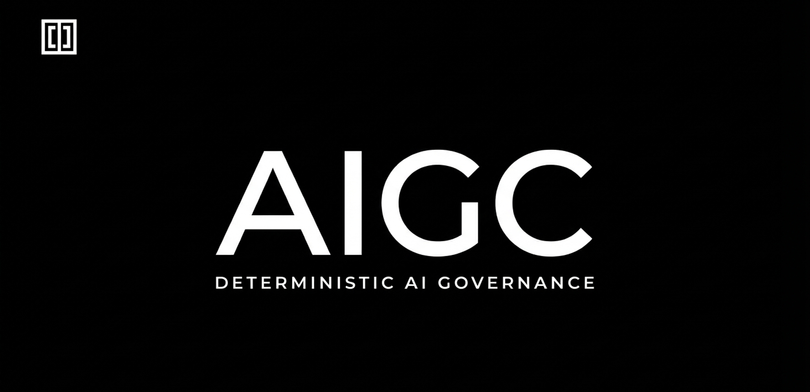

# AIGC — Auditable Intelligence Governance Contract



AIGC is a Python SDK for deterministic, fail-closed governance of AI model
invocations. It validates every invocation against a declared policy, enforces
role and schema constraints, evaluates optional custom gates and risk scoring,
and emits a tamper-evident audit artifact for every pass or fail path.

Governance in AIGC is runtime enforcement, not documentation and not prompting.

## At a Glance

- Package: `pip install aigc-sdk`
- Import: `import aigc`
- Current release: `v0.3.3` on `2026-04-10`
- Current release scope: invocation governance plus workflow-aware provenance
  and lineage groundwork, audit schema `v1.4`, `AuditLineage`,
  `ProvenanceGate`, `RiskHistory`, `@governed` defaults to split enforcement
- Verification baseline: `1376 tests`, coverage above the `90%` CI gate

## Why This Repo Exists

Most AI governance guidance stays advisory. AIGC is opinionated about turning
governance into an executable contract:

- Policies are declarative YAML and validated against JSON Schema.
- Enforcement is deterministic and fail-closed.
- Audit artifacts are mandatory, structured, and checksum-based.
- Governance is model- and provider-agnostic.
- Split enforcement is available when hosts need pre-call authorization before
  token spend.

If a model call cannot be justified by policy and evidenced by an audit record,
AIGC treats it as invalid.

## Runtime Model

AIGC sits at the invocation boundary between the host application and the model
provider.

1. The host assembles an invocation and selects a policy.
2. AIGC loads and resolves the policy, enforces ordered governance gates, and
   computes audit metadata.
3. AIGC returns or emits a PASS/FAIL audit artifact that can be stored,
   exported, chained, or inspected offline.

Since v0.3.3, split enforcement is the default — Phase A runs before the model
call, Phase B validates output after. Pass `pre_call_enforcement=False` for the
legacy unified mode (deprecated).

The source-only `v0.9.0` beta line on local `develop` adds workflow governance
built around `AIGC.open_session(...)`, `GovernanceSession`,
`SessionPreCallResult`, `aigc workflow init`, `aigc policy init`,
`aigc workflow lint`, and `aigc workflow doctor`. No external API keys are
required for the default adopter path. The currently shipped PyPI package
remains `v0.3.3`. Optional Bedrock/A2A adapters and
`aigc workflow trace` / `aigc workflow export` remain later PRs. The
target-state architecture is captured in
`docs/architecture/AIGC_HIGH_LEVEL_DESIGN.md`.

## Workflow Governance (v0.9.0 Beta)

Workflow governance is available in the source-only `v0.9.0` beta line on
local `develop`. No external API keys are required. Install from source, then:

```bash
aigc workflow init --profile minimal
cd governance
python workflow_example.py
# Status:  COMPLETED
# Steps:   2
# Session: <uuid>
```

**First-adopter docs (read in this order):**

1. [Workflow Quickstart](docs/reference/WORKFLOW_QUICKSTART.md)
2. [Migration Guide](docs/migration.md)
3. [Troubleshooting](docs/reference/TROUBLESHOOTING.md)
4. [Starter Recipes](docs/reference/STARTER_RECIPES.md)
5. [Workflow CLI Reference](docs/reference/WORKFLOW_CLI.md)
6. [Public API Contract](docs/PUBLIC_INTEGRATION_CONTRACT.md)
7. [Supported Environments](docs/reference/SUPPORTED_ENVIRONMENTS.md)
8. [Operations Runbook](docs/reference/OPERATIONS_RUNBOOK.md)

## Release Narrative

This is the versioned story of the repo's current state and how it evolved
release by release.

| Release | Date | What changed for users |
| ------- | ---- | ---------------------- |
| `0.1.0` | 2026-02-16 | Initial SDK: policy loading, role allowlists, preconditions, output schema validation, postconditions, deterministic audit artifacts |
| `0.1.1` to `0.1.3` | 2026-02-17 to 2026-02-23 | Installation and integration stabilization: context in audit artifacts, absolute policy paths, packaged schemas, public API guidance, `aigc-sdk` PyPI package name |
| `0.2.0` | 2026-03-06 | SDK ergonomics and operability: instance-scoped `AIGC`, typed preconditions, exception sanitization, policy caching, sink failure modes, audit schema `v1.2`, `InvocationBuilder`, AST-based guards, policy CLI |
| `0.3.0` | 2026-03-15 | Governance hardening: risk scoring, artifact signing, audit chain utility, pluggable `PolicyLoader`, policy dates, telemetry, policy testing, compliance export, custom gate isolation and metadata preservation |
| `0.3.1` | 2026-04-04 | Demo parity release: React demo and FastAPI backend became the maintained hands-on surface for all 7 labs |
| `0.3.2` | 2026-04-05 | Split enforcement release: `enforce_pre_call()` / `enforce_post_call()`, `PreCallResult`, split decorator mode, audit schema `v1.3`, and post-release security hardening from the 2026-04-05 audit |
| `0.3.3` | `2026-04-10` | Workflow-aware provenance and lineage groundwork: audit schema `v1.4` provenance metadata, `AuditLineage` DAG reconstruction, `ProvenanceGate` built-in enforcement gate, `RiskHistory` risk trend tracking, `@governed` defaults to `pre_call_enforcement=True` (split enforcement is the standard execution model) |

For the full change log, use [CHANGELOG.md](CHANGELOG.md).

## Installation

```bash
pip install aigc-sdk
```

Editable install from source:

```bash
python3 -m venv aigc-env
source aigc-env/bin/activate
pip install -e '.[dev]'
```

This standard source install expects access to PyPI or an internal package
mirror so pip can resolve `setuptools`, `PyYAML`, `jsonschema`, and their
transitive dependencies.

For restricted-network PR-07 proof runs, use
`python scripts/validate_v090_beta_proof.py` instead. That harness creates a
fresh venv with `system_site_packages=True` and installs this checkout with
`pip install --no-deps --no-build-isolation -e .` so it reuses the current
interpreter's installed Python packages without contacting an index.

## Quick Start

Unified enforcement remains the simplest integration path:

```python
from aigc import enforce_invocation

artifact = enforce_invocation(
    {
        "policy_file": "policies/base_policy.yaml",
        "model_provider": "anthropic",
        "model_identifier": "claude-sonnet-4-6",
        "role": "assistant",
        "input": {"query": "Summarize this incident"},
        "output": {"result": "Summary text", "confidence": 0.94},
        "context": {"role_declared": True, "schema_exists": True},
    }
)
```

For new code that needs isolated configuration, use the instance API:

```python
from aigc import AIGC, JsonFileAuditSink

engine = AIGC(sink=JsonFileAuditSink("audit.jsonl"))
artifact = engine.enforce(invocation)
```

## Split Enforcement in `v0.3.2`

Split mode lets you authorize before the model call and validate output after
the call:

```python
from aigc import enforce_post_call, enforce_pre_call

pre = enforce_pre_call(
    {
        "policy_file": "policies/base_policy.yaml",
        "model_provider": "anthropic",
        "model_identifier": "claude-sonnet-4-6",
        "role": "assistant",
        "input": {"query": "Summarize this incident"},
        "context": {"role_declared": True, "schema_exists": True},
    }
)

output = model.generate(...)
artifact = enforce_post_call(pre, output)
```

The `@governed` decorator uses split enforcement by default (since v0.3.3):

```python
from aigc import governed

@governed(
    policy_file="policies/base_policy.yaml",
    role="assistant",
    model_provider="anthropic",
    model_identifier="claude-sonnet-4-6",
)
def run_model(input_data, context):
    return model.generate(input_data)
```

Phase A runs before the model call; Phase B validates output after. Pass
`pre_call_enforcement=False` for legacy unified mode (deprecated).

## Interactive Demo

The maintained demo is a React frontend plus FastAPI backend:

- Site: [https://nealsolves.github.io/aigc/](https://nealsolves.github.io/aigc/)
- Coverage: 7 labs across risk scoring, signing, audit chain, composition,
  loaders and policy dates, custom gates, and compliance export
- Purpose: hands-on orientation to the runtime that shipped in `v0.3.x`

The repo also contains a local-only workflow beta lab in
`demo-app-react/src/labs/Lab11WorkflowLab.tsx` plus matching
`demo-app-api/workflow_routes.py` routes for the PR-07 failure-and-fix path.

## CLI Surface

The `aigc` console script exposes three practical commands:

- `aigc policy lint <file...>` for syntax and schema checks
- `aigc policy validate <file...>` for semantic validation, including
  composition and cycle detection
- `aigc compliance export --input audit.jsonl [--output report.json] [--lineage]`
  for offline compliance reporting over stored audit trails; add `--lineage` to
  include DAG-level lineage analysis (node counts, duplicate detection,
  root/leaf/orphan lists, cycle detection)

The source-only `v0.9.0` beta line adds `aigc workflow init`,
`aigc policy init`, `aigc workflow lint`, and `aigc workflow doctor`.
`aigc workflow trace` and `aigc workflow export` are planned for PR-09 and are
not yet available. The current PyPI release (`v0.3.3`) CLI surface is
unchanged.

## Repo Guide

If you are new to the repo, start here:

| Document | Why it matters |
| -------- | -------------- |
| [PROJECT.md](PROJECT.md) | Best repo-level orientation: architecture diagram, repo map, and release-by-release narrative |
| [Architecture Design](docs/architecture/AIGC_HIGH_LEVEL_DESIGN.md) | Target-state `1.0.0` architecture contract and invariants |
| [Integration Guide](docs/INTEGRATION_GUIDE.md) | Host integration patterns, split-mode guidance, and compliance checklist |
| [Policy DSL Spec](policies/policy_dsl_spec.md) | Full policy format reference |
| [Cookbook](docs/USAGE.md) | Task-oriented recipes for common integration patterns |
| [Public Integration Contract](docs/PUBLIC_INTEGRATION_CONTRACT.md) | End-to-end runnable integration contract |

## Development Gates

Before release, the repo expects these checks to pass locally:

```bash
python -m pytest --cov=aigc --cov-report=term-missing --cov-fail-under=90
flake8 aigc
npx markdownlint-cli2 "**/*.md"
```
