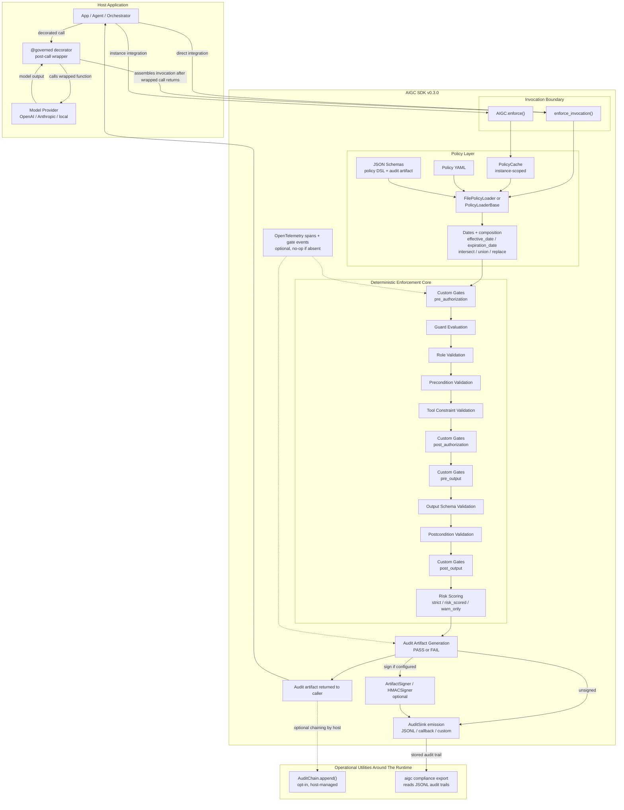

# AIGC v0.3.0 Architecture Diagram

This document is a historical snapshot of the runtime architecture that shipped
in `v0.3.0`.

For the current release architecture, use the `v0.3.2` assets under
`docs/architecture/diagrams/` together with
`docs/architecture/AIGC_HIGH_LEVEL_DESIGN.md`.

It intentionally excludes roadmap-only concepts that are discussed elsewhere
but are not importable SDK features in `0.3.0`, including
`GovernedToolExecutor`, `GovernedLLMProvider`, `register_validator`,
and `register_resolver`.

## Component View

## Pipeline View

```mermaid
flowchart LR
    Start["Invocation received"] --> Load["Invocation validation + policy load"]
    Load --> PreAuth["Custom gates<br/>pre_authorization"]
    PreAuth --> Guards["Guard evaluation"]
    Guards --> Role["Role validation"]
    Role --> Preconditions["Precondition validation"]
    Preconditions --> Tools["Tool constraint validation"]
    Tools --> PostAuth["Custom gates<br/>post_authorization"]
    PostAuth --> PreOutput["Custom gates<br/>pre_output"]
    PreOutput --> Schema["Output schema validation"]
    Schema --> Postconditions["Postcondition validation"]
    Postconditions --> PostOutput["Custom gates<br/>post_output"]
    PostOutput --> Risk["Risk scoring<br/>if configured"]
    Risk --> Audit["Generate PASS / FAIL audit artifact"]
    Audit --> Emit["Emit to sink + return artifact"]
```

## Notes

- `@governed` is post-call governance. The wrapped function runs first, then
  AIGC assembles the invocation and enforces policy on the result.
- `AuditChain` is not part of the automatic enforcement pipeline in `0.3.0`.
  It is an opt-in utility the host applies to artifacts it manages.
- `aigc compliance export` is an offline analysis step over stored audit
  artifacts, not a live runtime gate.
- Pre-pipeline failures still produce schema-valid FAIL artifacts, but they
  bypass the core gate sequence because enforcement never fully starts.
