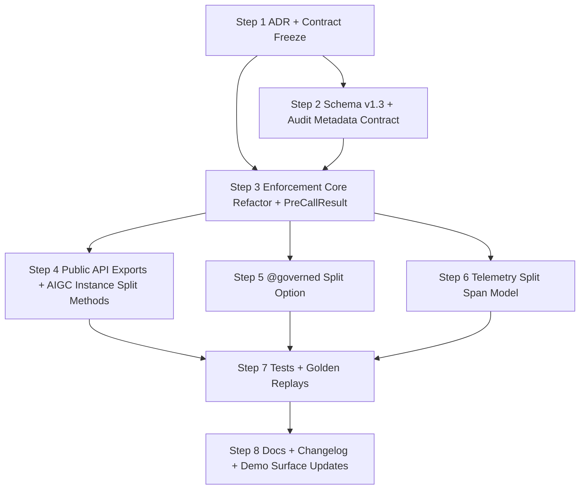

# v0.3.2 Implementation Plan — Split Enforcement

Date: 2026-04-04
Status: Proposed
Baseline: `v0.3.1` codebase

---

## Dependency Graph

---

## Step 1: ADR and Contract Freeze

Why first: all core invariants and compatibility behaviors depend on this decision.

Files to modify/create:

- `docs/decisions/ADR-0009-split-enforcement-model.md` (refine)
- `docs/architecture/ARCHITECTURAL_INVARIANTS.md` (clarify split interpretation)

Public API changes:

- None yet.

Test files to create:

- None yet.

Golden replay fixtures needed:

- None yet.

Estimated test count:

- 0

---

## Step 2: Audit Schema v1.3 and Artifact Contract

Depends on: Step 1.

Why second: enforcement and tests need a stable artifact contract.

Files to modify/create:

- `schemas/audit_artifact.schema.json`
- `aigc/_internal/audit.py`
- `tests/test_audit_artifact_contract.py`
- `tests/test_pre_pipeline_artifact_schema.py`

Public API changes:

- `AUDIT_SCHEMA_VERSION` moves from `1.2` to `1.3` in public audit helpers.

Test files to create:

- `tests/test_audit_artifact_split_metadata.py` (new)

Golden replay fixtures needed:

- update expected stable schema version fields where asserted

Estimated test count:

- ~8

---

## Step 3: Enforcement Core Refactor + PreCallResult

Depends on: Step 1 and Step 2.

Why third: this is the structural center of v0.3.2.

Files to modify/create:

- `aigc/_internal/enforcement.py`
- `aigc/_internal/errors.py` (only if new typed error for invalid pre-call result is required)

Public API changes:

- New: `PreCallResult`
- New: `enforce_pre_call()`, `enforce_post_call()`
- New: `enforce_pre_call_async()`, `enforce_post_call_async()`
- Existing: `enforce_invocation()` remains backward-compatible wrapper

Test files to create:

- `tests/test_split_enforcement.py`
- `tests/test_precall_result.py`
- `tests/test_split_enforcement_aigc_instance.py`
- `tests/test_split_enforcement_async.py`

Golden replay fixtures needed:

- `tests/golden_replays/golden_invocation_split_pass.json`
- `tests/golden_replays/golden_invocation_split_pre_fail_role.json`
- `tests/golden_replays/golden_invocation_split_pre_fail_precondition.json`
- `tests/golden_replays/golden_invocation_split_pre_fail_custom_gate.json`
- `tests/golden_replays/golden_invocation_split_post_fail_schema.json`
- `tests/golden_replays/golden_invocation_split_post_fail_risk.json`
- `tests/golden_replays/golden_invocation_unified_backcompat_v032.json`

Estimated test count:

- ~30

---

## Step 4: Public API Exports and Instance-Scoped Split Methods

Depends on: Step 3.

Why fourth: expose the new capability after core behavior is stable.

Files to modify/create:

- `aigc/enforcement.py`
- `aigc/__init__.py`
- `tests/test_public_api.py`

Public API changes:

- Export split functions and `PreCallResult` from top-level `aigc` and `aigc.enforcement`.

Test files to create:

- `tests/test_public_api_split_exports.py`

Golden replay fixtures needed:

- None.

Estimated test count:

- ~6

---

## Step 5: @governed Split Option

Depends on: Step 3.

Why fifth: decorator behavior depends directly on split entry points.

Files to modify/create:

- `aigc/_internal/decorators.py`
- `tests/test_decorators.py`
- `docs/PUBLIC_INTEGRATION_CONTRACT.md` (usage examples)
- `docs/INTEGRATION_GUIDE.md`

Public API changes:

- `governed(..., pre_call_enforcement: bool = False)`

Test files to create:

- `tests/test_decorators_split_mode.py`

Golden replay fixtures needed:

- `tests/golden_replays/golden_decorator_split_pre_block.json`
- `tests/golden_replays/golden_decorator_unified_default.json`

Estimated test count:

- ~10

---

## Step 6: Telemetry Split Span Model

Depends on: Step 3.

Why sixth: observability should match split semantics before final verification.

Files to modify/create:

- `aigc/_internal/telemetry.py`
- `aigc/_internal/enforcement.py`
- `tests/test_telemetry.py`

Public API changes:

- None.

Test files to create:

- `tests/test_telemetry_split_enforcement.py`

Golden replay fixtures needed:

- None.

Estimated test count:

- ~5

---

## Step 7: Full Regression, Golden Replays, and Edge Cases

Depends on: Steps 4, 5, 6.

Why seventh: this is the compatibility gate before docs/release edits.

Files to modify/create:

- `tests/test_pre_action_boundary.py` (assert split ordering evidence)
- `tests/test_retry.py` (document unified and split interaction assumptions)
- `tests/test_golden_replay_*.py` files as needed
- `tests/golden_replays/*` new fixtures

Public API changes:

- None.

Test files to create:

- `tests/test_split_enforcement_edge_cases.py`

Golden replay fixtures needed:

- missing pre-result, invalid pre-result type, and reused pre-result fixtures

Estimated test count:

- ~18

---

## Step 8: Documentation, Changelog, and Demo Surface Alignment

Depends on: Step 7.

Why last: publish only after behavior is verified.

Files to modify/create:

- `README.md`
- `CHANGELOG.md`
- `PROJECT.md`
- `docs/architecture/AIGC_HIGH_LEVEL_DESIGN.md`
- `docs/architecture/ENFORCEMENT_PIPELINE.md`
- `docs/architecture/ARCHITECTURAL_INVARIANTS.md`
- `docs/INTEGRATION_GUIDE.md`
- `docs/PUBLIC_INTEGRATION_CONTRACT.md`

Public API changes:

- None beyond already shipped split exports.

Test files to create:

- None.

Golden replay fixtures needed:

- None.

Estimated test count:

- 0 (docs stage)

---

## Total Estimated New Tests

Projected: ~77 net new tests.

Conservative shipping target for v0.3.2:

- minimum acceptable: ~55
- recommended: 70+

---

## Demo-App React Note (Release-Critical)

`demo-app-react` must be updated in the same release window to avoid UI-contract drift from SDK behavior.

Required updates:

- expose split vs unified mode in lab controls,
- visualize Phase A block before model call,
- display `metadata.enforcement_mode`, `pre_call_gates_evaluated`, and `post_call_gates_evaluated`,
- update examples and help text to reflect `pre_call_enforcement=False` default and opt-in split mode.
