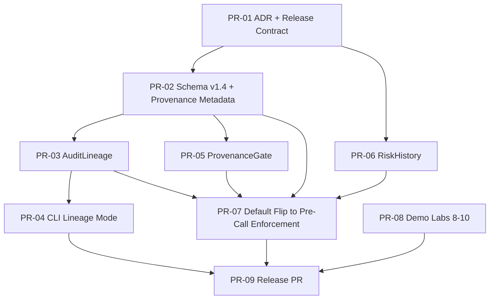

# v0.3.3 Implementation Plan — Governed Agentic Workflows

Date: 2026-04-08
Status: Proposed
Baseline: `v0.3.2`

---

## Release Intent

`v0.3.3` is the first release that makes AIGC workflow-aware.

The release moves the SDK from:

- governing each LLM call

to:

- governing chains of calls across an agentic workflow

This implementation plan is limited to the workflow-aware SDK work named in the
provided planning materials:

- provenance metadata
- `AuditLineage`
- `ProvenanceGate`
- `RiskHistory`
- default split enforcement via `pre_call_enforcement=True`

Tracked downstream but not expanded here as core SDK work:

- CLI lineage mode, which consumes `AuditLineage`
- Labs 8-10 demo surface
- final release packaging PR

---

## Scope

In scope:

- additive audit schema `v1.4` provenance metadata
- lineage reconstruction across multiple audit artifacts
- source-aware runtime enforcement via a built-in provenance gate
- trust-over-time advisory tracking
- default flip to pre-call enforcement with explicit legacy opt-out retained
- PR-01 release-contract documents that lock this scope before code

Out of scope for this plan:

- runtime behavior outside the supplied `v0.3.3` planning sequence
- new required audit artifact fields
- a two-artifact execution model
- a rewrite or fork of the existing architecture
- unplanned policy DSL changes

---

## Dependency Graph

---

## PR-01 — ADR + Release Contract for `v0.3.3`

Goal: lock scope before code.

Why first:

- this repo treats decision capture, release gates, and documentation parity as
  binding release inputs
- later PRs need a stable contract for scope, sequencing, and compatibility

Docs and tracking outputs:

- `docs/decisions/ADR-0010-governed-agentic-workflows.md`
- `docs/dev/pr_context.md`
- `RELEASE_GATES.md`
- `implementation_status.md`
- `docs/plans/v0.3.3_IMPLEMENTATION_PLAN.md`
- `docs/plans/v0.3.3_DOCS_ONLY_PR_PLAN.md`

Exit gate:

- ADR accepted
- active PR context explicit
- release gates seeded
- no code yet

---

## PR-02 — Audit Schema `v1.4` + Provenance Metadata

Goal: introduce the additive artifact contract for workflow provenance.

Why second:

- provenance is the base contract for lineage reconstruction and source-aware
  enforcement

Planned runtime and test surface:

- `schemas/audit_artifact.schema.json`
- internal/public audit generation paths
- schema and artifact contract tests

Planned documentation parity targets:

- `README.md`
- `PROJECT.md`
- `CHANGELOG.md`
- `docs/INTEGRATION_GUIDE.md`
- `docs/PUBLIC_INTEGRATION_CONTRACT.md`

Planned contract additions:

- optional `provenance` object
- `source_ids`
- `derived_from_audit_checksums`
- `compilation_source_hash`

Exit gate:

- additive backward-compatible schema only
- PASS/FAIL artifacts remain valid
- no new required fields

Reference estimate from planning note:

- ~15 tests

---

## PR-03 — `AuditLineage` Module

Goal: add lineage reconstruction from JSONL audit trails.

Why third:

- depends on provenance fields being defined first

Planned runtime and test surface:

- `aigc/_internal/lineage.py`
- `aigc/lineage.py`
- `aigc/__init__.py` export updates
- lineage tests for DAG build, traversal, orphan handling, and cycle detection

Planned documentation parity targets:

- `README.md`
- `PROJECT.md`
- `docs/INTEGRATION_GUIDE.md`
- `docs/PUBLIC_INTEGRATION_CONTRACT.md`

Exit gate:

- lineage traces artifacts by checksum
- no new dependencies

Reference estimate from planning note:

- ~20 tests

---

## PR-04 — CLI Lineage Mode

Goal: extend compliance export with `--lineage`.

Why fourth:

- the CLI should consume `AuditLineage`, not invent separate traversal logic

Planned runtime and test surface:

- internal/public CLI updates
- compliance export integration with `AuditLineage`
- report output tests

Planned documentation parity targets:

- `README.md`
- `docs/INTEGRATION_GUIDE.md`
- `docs/USAGE.md`

Reference estimate from planning note:

- ~8 tests

---

## PR-05 — Built-In `ProvenanceGate`

Goal: add the first workflow-aware built-in gate.

Why fifth:

- this is the point where provenance becomes enforceable runtime behavior

Planned runtime and test surface:

- built-in gate implementation
- registration at `INSERTION_PRE_AUTHORIZATION` and/or
  `INSERTION_PRE_OUTPUT`
- typed failures
- gate tests

Planned documentation parity targets:

- `README.md`
- `PROJECT.md`
- `docs/INTEGRATION_GUIDE.md`
- `docs/PUBLIC_INTEGRATION_CONTRACT.md`
- `docs/architecture/ENFORCEMENT_PIPELINE.md`

Exit gate:

- "no output without sources" is enforceable through the built-in gate
- insertion-point behavior is documented and tested

Reference estimate from planning note:

- ~10 tests

---

## PR-06 — `RiskHistory` Advisory Utility

Goal: add graduated trust over time.

Why sixth:

- it is part of the `v0.3.3` workflow-awareness package and can land
  independently of CLI lineage mode

Planned runtime and test surface:

- `aigc/_internal/risk_history.py`
- `aigc/risk_history.py`
- `aigc/__init__.py` export updates
- usage tests

Planned documentation parity targets:

- `README.md`
- `PROJECT.md`
- `docs/INTEGRATION_GUIDE.md`
- `docs/USAGE.md`

Exit gate:

- risk scores can be tracked over time for an entity
- trajectory states are available for improving, stable, and degrading paths

Reference estimate from planning note:

- ~15 tests

---

## PR-07 — `@governed` Default Flip to `pre_call_enforcement=True`

Goal: make split enforcement the default execution model.

Why seventh:

- the workflow-aware primitives should exist before the default flips

Planned runtime and test surface:

- decorator default update
- migration tests
- docs and changelog migration notes

Planned documentation parity targets:

- `README.md`
- `PROJECT.md`
- `CHANGELOG.md`
- `docs/INTEGRATION_GUIDE.md`
- `docs/PUBLIC_INTEGRATION_CONTRACT.md`
- `docs/architecture/AIGC_HIGH_LEVEL_DESIGN.md`
- `docs/architecture/ARCHITECTURAL_INVARIANTS.md`

Exit gate:

- legacy behavior remains available via explicit
  `pre_call_enforcement=False`
- one artifact per invocation is preserved
- gate ordering is preserved

Reference estimate from planning note:

- ~5 migration tests

---

## Downstream Release Sequence

These PRs remain in the supplied release sequence, but they are not the core
SDK focus of this implementation plan.

### PR-08 — Labs 8-10 Demo Surface

Tracked downstream deliverables:

- Lab 8: Governed Knowledge Base
- Lab 9: Governed vs. Ungoverned
- Lab 10: Split Enforcement Explorer

### PR-09 — `v0.3.3` Release PR

Tracked downstream deliverables:

- version bump
- release notes
- docs parity sweep
- final changelog
- release gate checklist
- migration section

---

## Contract Watchpoints

These constraints are binding across the sequence:

- schema evolution remains additive
- provenance fields remain optional in `v1.4`
- one audit artifact per invocation attempt remains intact
- lineage reconstruction uses audit checksums
- no new dependencies are introduced for `AuditLineage`
- explicit opt-out remains for hosts that need legacy unified decorator behavior
- split enforcement remains the standard model without changing gate order

---

## Source Inputs

This plan is grounded in:

- the supplied post-`v0.3.2` evolution plan for "Governed Agentic Workflows"
- the supplied PR sequence plan for `v0.3.3`
- `docs/decisions/ADR-0009-split-enforcement-model.md`
- `docs/architecture/ARCHITECTURAL_INVARIANTS.md`
